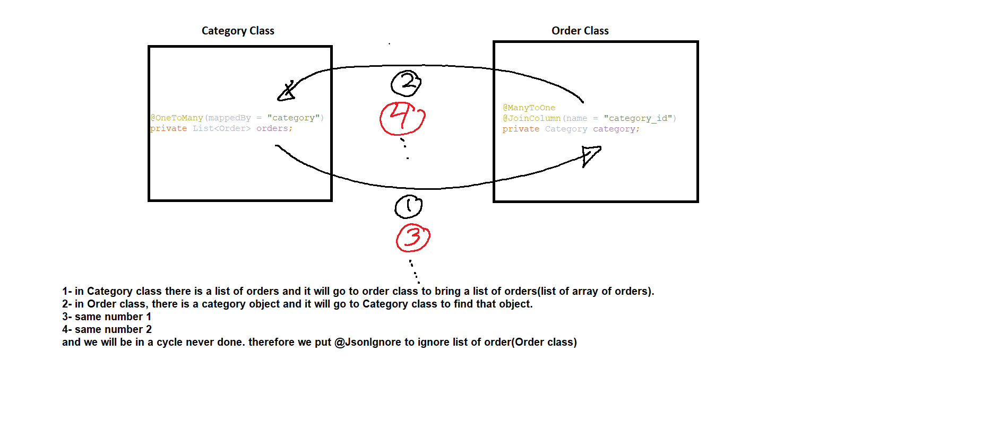
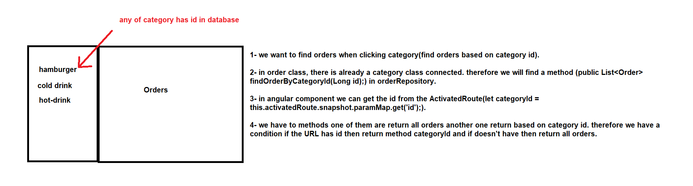
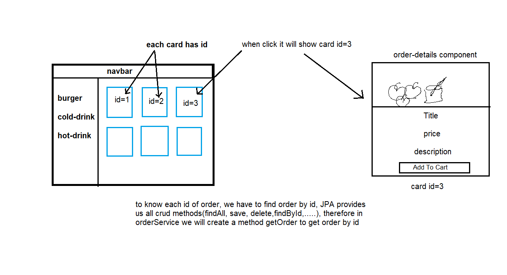
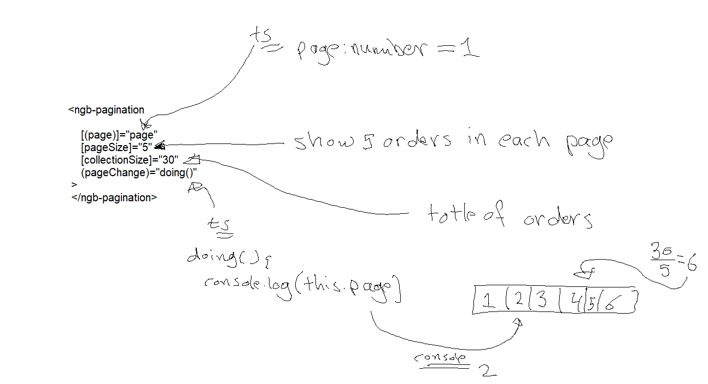
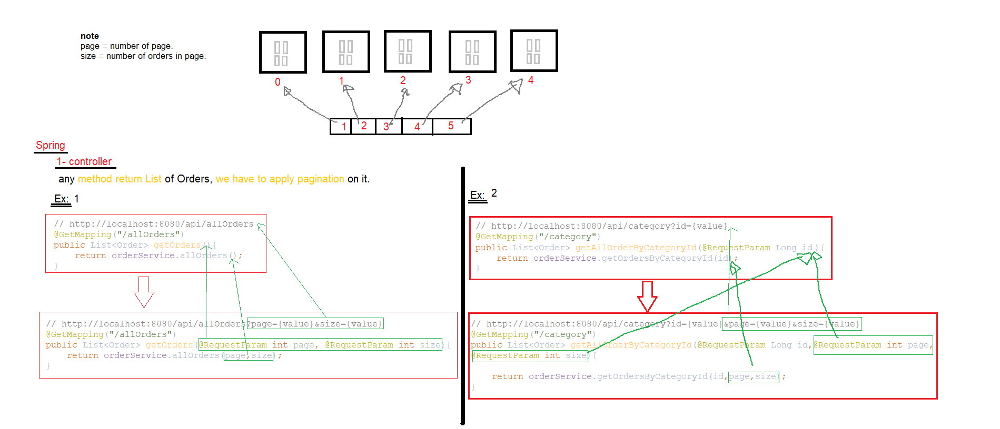
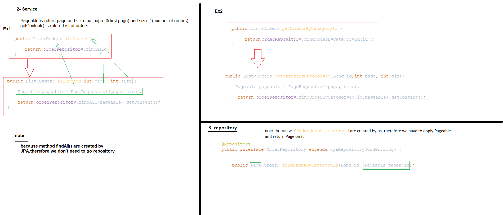
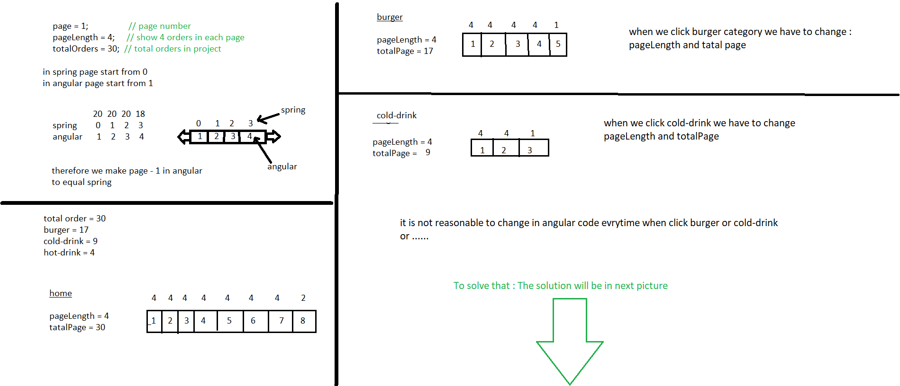
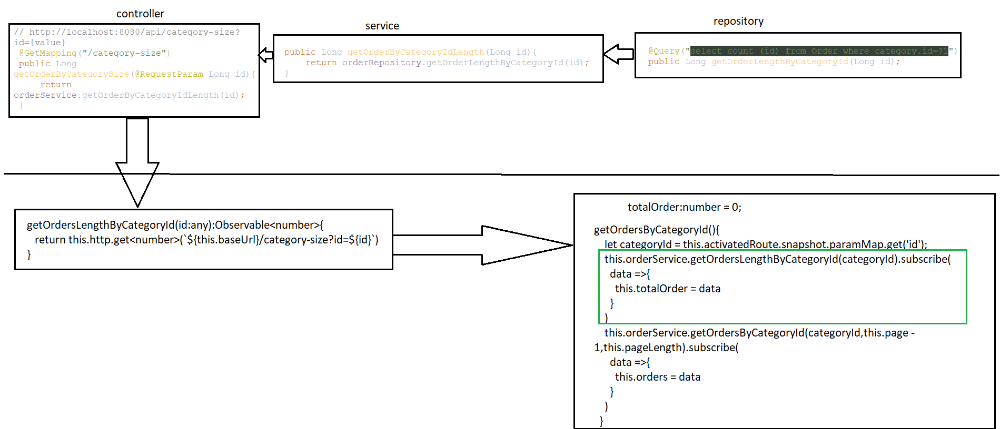

1- create Category and Order class,
   relationship is : one Category has many orders,and many orders have one category.

2- application.properties 
3- create Category and Order repository 
4- create Category and Order service 
5- get all Category and add @JsonIgnore into Category class 
http://localhost:8080/api/allCategories   
note:

if you are not put @JsonIgnore into the Category class you get an error when you try to retrieve all categories, the problem called a cycle

6- get all Orders  
http://localhost:8080/api/allOrders   

................................................................................................................

Angular  
1- create model package and Category,Order class.  
2- create order service  
3- create order component

Spring  

add corsOrigin in the main class 

Angular  
1- create component order-list and change design  
2- create component category-list  
3- create service category  
4- create routes  

Spring  

1- create method findOrderByCategoryId in orderRepository 
2- create method in orderService 
3- create method in orderController 

Angular  
1- create method findOrdersByCategoryId in order service 
2- create method in order component 
3- create routerLink and activatedRouterLink 
4- create dropdown-menu component 

Spring 
1- create findOrderByOrderNameContaining in order repository. 
2- create getOrdersByKey in order service. 
3- create getOrderByKey in order controller. 
4- test http://localhost:8080/api/order-key?key=f   

Angular
1- write path in app-routing.module.ts  
2- create getOrdersByKey in order service  
3- create search component  

Angular 
1- create order-detail component  

Spring 
  
1- create getOrder in order service 
2- create getOrderById in order controller 
3- http://localhost:8080/api/order?id=3  

Angular 
1- create getOrderById in orderService. 
2- create getOrderByOrderIdin order component 
3- get order in order-details.html component 

Angular 
<h2>pagination</h2>  
1- to add pagination into bootstrap(for angular9 and up) we have to use ng add @angular/localize 
2- add also npm install @ng-bootstrap/ng-bootstrap 
3- in app.module.ts in import section add NgbPaginationModule 

  

Spring 
1- apply Pageable to the methods in controller,service,repository. 
  
  

Angular 
1- change method's path, to add page and size in orderService. 
  
  

Angular 
1- [maxSize]="3"  its mean size of pagination 
2-[boundaryLinks]="true" it's the arrow to go first or last 
3- create size for pagination  

